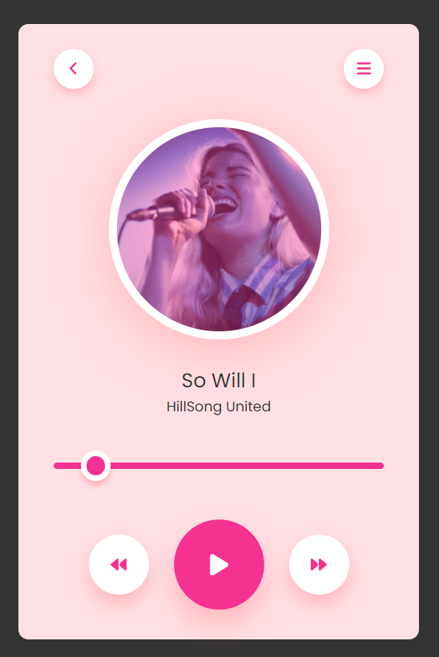

**Simple Music Player App**

## Overview:
Welcome to the Simple Music Player App! This lightweight web application is designed to play a single music track. It offers a straightforward interface built with HTML, CSS, and JavaScript, allowing users to enjoy their favorite tunes hassle-free.

## Features:
1. **Play/Pause Control:** Easily play or pause the music playback.
2. **Track Selection:** Users can play the single available track.
3. **Progress Bar:** Displays the progress of the currently playing track and allows users to seek to different parts of the track.

## Technologies Used:
- **HTML:** Provides the structure and content of the web page.
- **CSS:** Styles the elements and enhances the visual appeal of the app.
- **JavaScript:** Implements the functionality, including audio playback controls and track selection.

## Getting Started:
To run the Simple Music Player App locally, follow these steps:

1. **Clone the Repository:** Clone this repository to your local machine using the following command:
   ```
   git clone https://github.com/yourusername/Music-Player.git
   ```

2. **Navigate to the Directory:** Move into the directory containing the Music Player App files:
   ```
   cd Music-Player
   ```

3. **Open Index.html:** Open the `index.html` file in your preferred web browser.

## Usage:
1. **Play/Pause:** Click the play/pause button to start or pause the playback of the track.
2. **Track Progress:** Use the progress bar to track the playback progress and seek to different parts of the track.

## Preview:


## Support:
For any questions, issues, or feedback, please contact namatovutrismari@gmail.com.

## License:
This project is licensed under the [MIT License](LICENSE). Feel free to modify and distribute the code for personal or commercial use.

